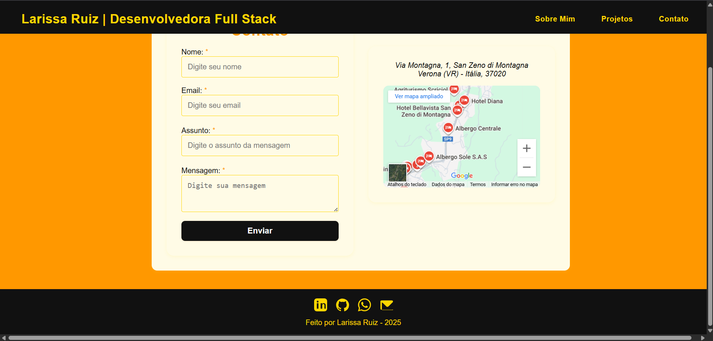

# Portfólio Profissional – Larissa Ruiz

Este repositório contém meu portfólio pessoal, desenvolvido para apresentar meus projetos, habilidades e trajetória como Desenvolvedora Full Stack. O objetivo é mostrar meu trabalho, facilitar o contato e captar novas oportunidades.

## Prévia de Portfólio

---

## 🛠️ Tecnologias Utilizadas
- **HTML5** – Estrutura semântica da página
- **CSS3** – Estilização, layout responsivo e animações
- **JavaScript** – Interatividade e funcionalidades
- **Formspree** – Integração do formulário de contato
- **SVG** – Ícones personalizados nas redes sociais
  
---

##  Desenvolvimento
Durante o desenvolvimento deste portfólio, pratiquei e aprofundei:

- Estruturei páginas com HTML5 semântico, focando em clareza e acessibilidade.
- Desenvolvi layouts modernos, responsivos e atraentes usando Flexbox.
- Apliquei estilização avançada, paleta personalizada e variáveis no CSS para identidade visual marcante.
- Implementei boas práticas de UI/UX, tornando a navegação intuitiva e agradável.
- Integrei formulários reais (Formspree) e ícones SVG personalizados para redes sociais e contato.
- Organizei os projetos de forma visual e estratégica, pensando na experiência do cliente e na apresentação profissional.
  
---
Projeto desenvolvido por Larissa Ruiz em 2025.
